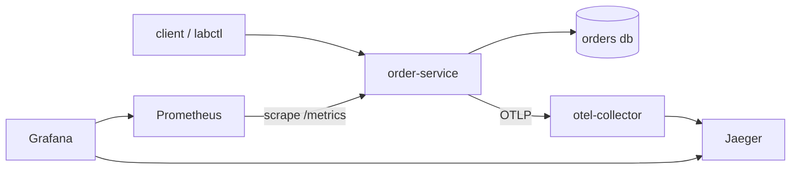

# go-resilient-commerce-lab

## What this is

A local, runnable Go microservices lab that reproduces the failure modes real
distributed backends face: client retries, duplicate events, partial failure,
payment uncertainty, and inventory contention. Each slice ships working code,
a one-command reproducible demo, and a blog post written from what actually
happened.

## Quick start

```bash
make docker-up
make scenario NAME=duplicate-order
make docker-down
```

`docker-up` builds and starts the stack. `scenario` drives the order service
through a live scenario and asserts its own outcome, exiting non-zero on
failure. `docker-down` tears the stack down and removes its volumes.

While the stack is up:

- order service: http://localhost:8080/healthz
- Jaeger UI: http://localhost:16686
- Prometheus: http://localhost:9090
- Grafana: http://localhost:3300

## Topology



The interactive version of this diagram is on the site; the README keeps a
static Mermaid one because GitHub renders it inline.

## The rules that keep it honest

- Four separate logical databases, so no cross-service transaction is possible.
- `internal/` holds no business rules.
- Every state change commits with its outbox event, in the same transaction.
- Liveness checks nothing; readiness checks the database pool.

## Make targets

| Target | What it does |
| --- | --- |
| `fmt` | Format code with `golangci-lint fmt` |
| `lint` | Verify lint config and run `golangci-lint` |
| `vet` | Run `go vet` |
| `test` | Run unit tests |
| `test-race` | Run unit tests with the race detector |
| `integration` | Run integration tests against real Postgres |
| `run` | Run the order service locally |
| `docker-up` | Build and start the full stack |
| `docker-down` | Stop the stack and remove its volumes |
| `scenario NAME=<name>` | Drive a scenario against the running stack |
| `site` | Serve the Hugo site locally |

## Where things live

- Design: [`docs/superpowers/specs/2026-09-07-go-resilient-commerce-lab-design.md`](docs/superpowers/specs/2026-09-07-go-resilient-commerce-lab-design.md)
- Epic A plan: [`docs/superpowers/plans/2026-09-07-epic-a-foundation-and-idempotency.md`](docs/superpowers/plans/2026-09-07-epic-a-foundation-and-idempotency.md)
